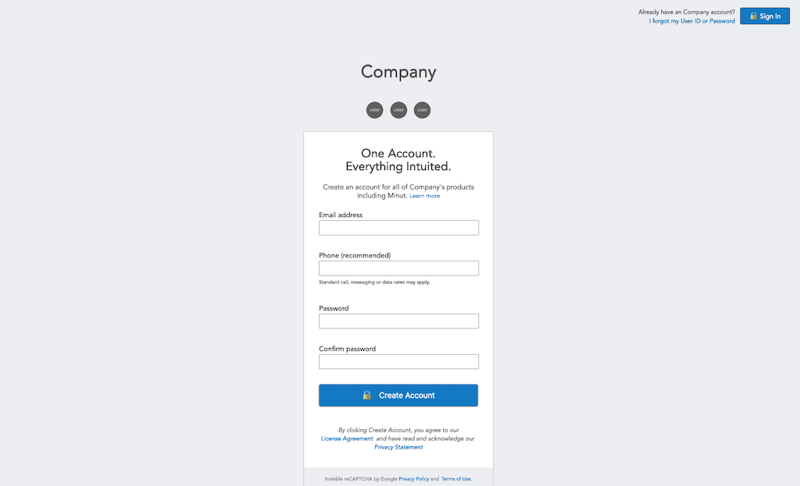

# Mint signup page design copy

I created this to learn about basic HTML forms.

This was one of the projects from [The Odin Project](https://www.theodinproject.com/home) - Full Stack Curriculum.

# Created at

March 2, 2017

# Project is created with

* HTML
* CSS

# View on browser

## [https://n00bg1rl.github.io/form/](https://n00bg1rl.github.io/form/)

# View as image

